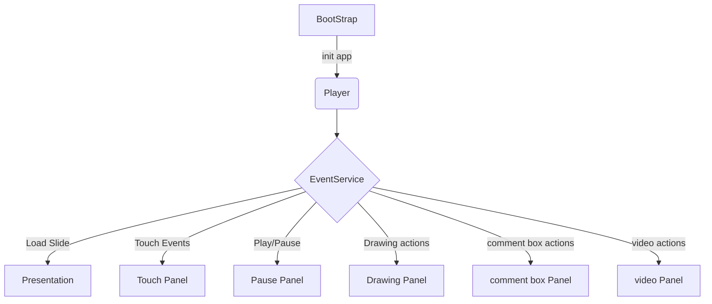
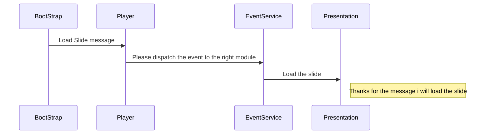

 # SDK JS PLAYER
The SDK JS Player is a **cross-browser** JS library that can be installed and used easily in different platforms. the main goal of the SDK JS Player is the use the same player in different products whether in IOS, android or the JS App.
The library need a **div container** to inject and load the different modules


# Getting started

First. the library is developed in TypeScript and compiled to the es5 javascript.
Webpack is used to orchestrate tasks, run local sever,  and build the library

  > [webpack](https://webpack.js.org/)

 1. Go to project folder and install dependencies:
 ```bash
 npm install
 ```

2.  To run the library in local mode (standalone mode) we need to serve
 an entry point (an index.html for example) to load and run the library (webpack-dev-server can create a local server)

2. To build the library :
 ```bash
 cross-env NODE_ENV=production webpack --config webpack.config.js
 ```
webpack config files are used for each particular environment.
# Project structure

```
dist/                        compiled version
sdk/                         project source code
|- constant/                 constants declaration
|- images/                   Images
|- models/                   Models declaration
|- modules/                  Modules declaration
|- shared/                   Shared services
|- Bootstrap.ts              The main class to load the app
|- Config.ts                 Class to add config variables
|- Player.ts                 Classe to laod and iniate the diffirents modules
.env                         Production environment
.env.develop                 Development environment
package.json                 Package json
tsconfig.json                ts config
tslint.json                  tslint config
webpack.config.js            Webpack prod config
webpack.develop.config.js       Webpack dev config
```

## How to use

 1. ## load the library
 The library is accessible through the CDN (We can use a dev, QA or prod CDN following the environment)
 the CDN for the dev env is :
 https://isharing-js-sdk.dev.kadrige.com/sdk.min.js

 2. ## How to use
The entry point of the library is the Global variable **SDK**.

First we need to bootstrap the app by calling the Bootstrap class and passing the **ID** of the **div container**
  ### exemple
         new SDK.Bootstrap('player-js-container');
 3. ## Exposed functions

-  Getting an instance of the SDK :

           sdk = new SDK.Bootstrap('player-js-container');
- To send data to the SDK we need to call the following function

           sdk.getPlayerJS().eventDispatcher(message);

**eventDispatcher** pass the **data**  from the external app to the SDK.
the message contain informations, an action to execute like the load slide, perform a click or drawing.

The message is an JSON that contain different data following the type of the action.  To differentiate actions we need to define the **type** property.
the type property can contain different values :
**load-slide,  notification,  touch-gesture,  draw-action**

- Get data from the SDK

the SDK can send data to the external app. for that the external app need to call **eventObservable** function

This function return an observable of events.  Every event return data following the type of the action

	sdk.getPlayerJS().eventObservable.subscribe((data) => {
	   ....... action the execute
	})


 - Inject the library in the container

By default to html  injection is performed at the initialization if the div container is accessible at this point.  In some uses cases. we want to init the library and inject it later later according to the flow of the execution. (the div container is not yet loaded in the dom) . For that we can use the following function the inject the HTML

    sdk.getPlayerJS().initModulesHTML();

## Additional tools
Extra tools and third party library are used in the project

The most important tools :
### inversifyJS :
Is a lightweight inversion of control (IoC) container for TypeScript and JavaScript apps
### RxJS :
Is a library for reactive programming using Observables, to make it easier to compose asynchronous or callback-based code.
###  dotenv-webpack
A webpack plugin to support  dotenv.  **dotenv** is tool to config file environment and load a specific config for each env
### TSLint
Is an analysis tool that checks TypeScript code for readability, maintainability, and functionality errors


## Architecture

This an architectural schema of the project
>This schema is made with marmaid . A markdown-like script language for generating charts from text via javascript)



Example of **load slide**


